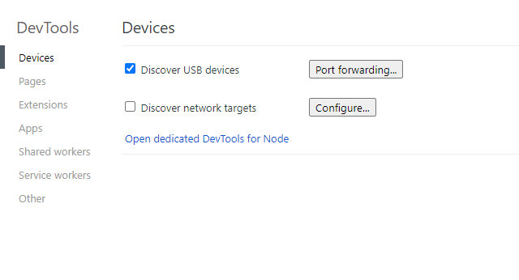
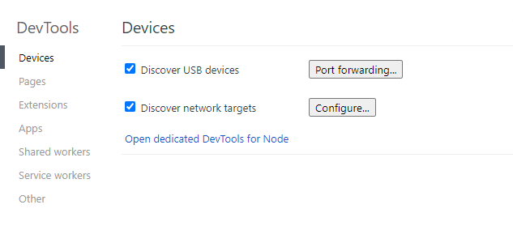
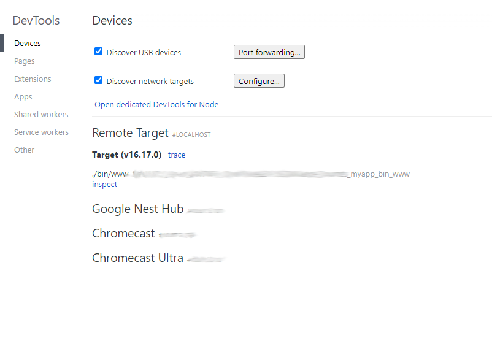
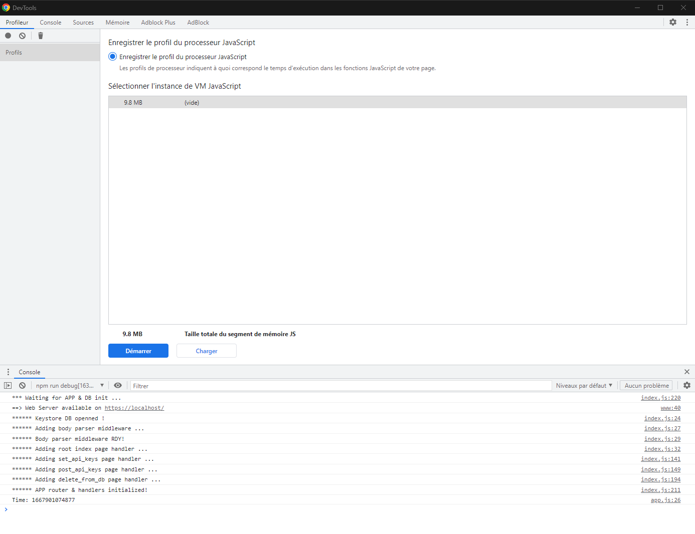
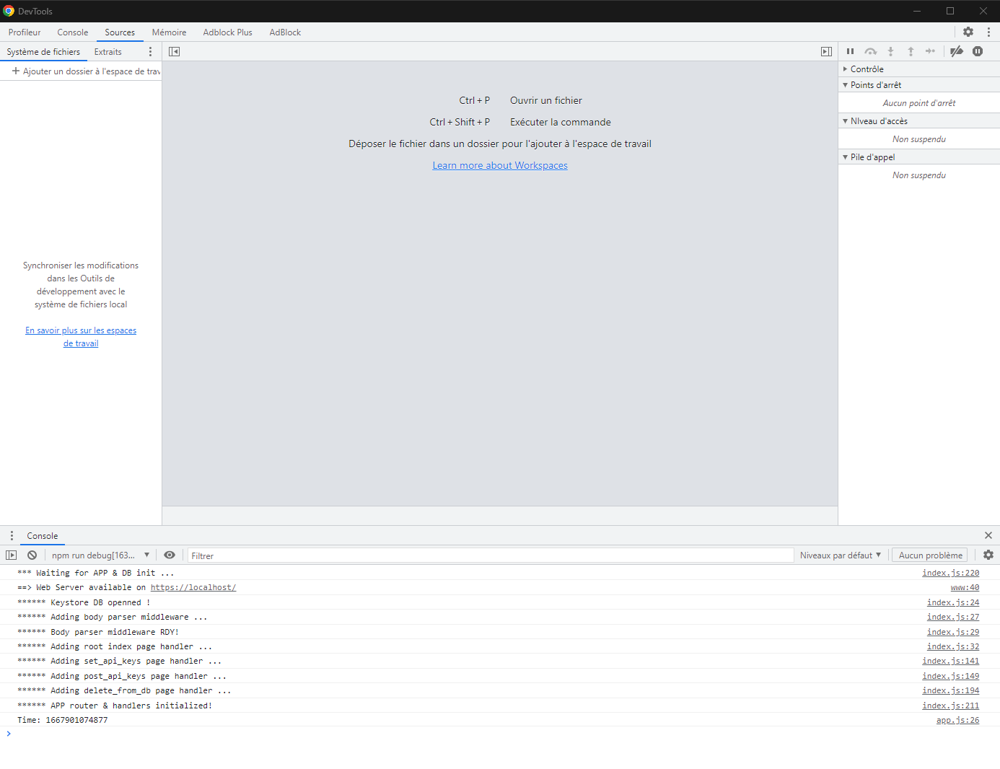
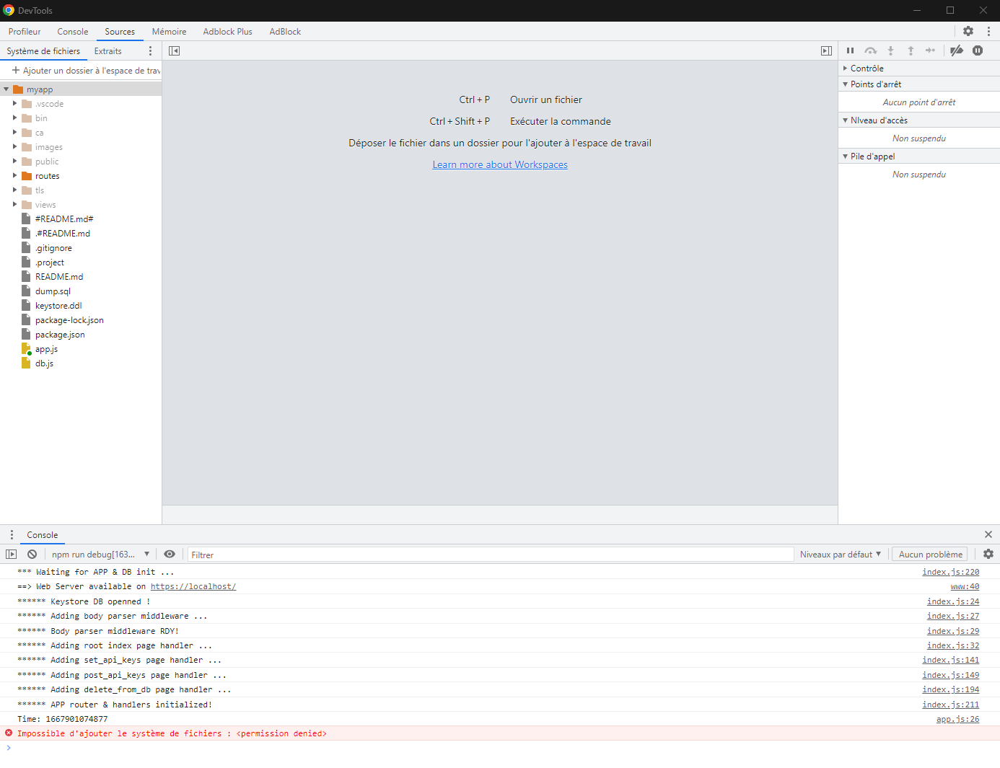

# my_robot_app

A NodeJS web app for tracking trade orders and duplicate them on a predetermined exchange.
The app is developped using Express framework with NodeJS and the Pug templating engine as
views renderer.
The app uses Exchanges API keys[^1] for tracking and duplicating orders. These are stored locally
in an SQLite3 DB.

> Please be aware this is a work in progress !!! 

[^1]: Take care to the keys when dumping/restoring databases. Keys exposed here are not real keys but take care to yours.

## Clone repository

In order to use the webapp, clone the repository and issue the npm command:
```bash
MINGW64 $ npm install
```
This will download and install all node module dependencies for running the express/pug
webapp.
Please refers to the following documentations for context of this webapp dev:
 * [NodeJS docs](https://nodejs.org/en/docs/),
 * [NPM docs](https://docs.npmjs.com/),
 * [ExpressJS framework](https://expressjs.com/) and [Dev template engines with ExpressJS ](https://expressjs.com/en/advanced/developing-template-engines.html)
 * [Pug templating engine docs](https://pugjs.org/api/getting-started.html)

## WebApp Initialization

The keystore.ddl file contains the SQL statements for creating tables and populating records
used.
In order to init database a script named `keystoredb` is defined in the bin directory. It is
used through the package.json scripts. Just issue the following command
```bash
MINGW64 $ npm run initdb
```
By looking in the `package.json` file you can see the keystoredb script is launched through
a NodeJS invocation:
```bash
MINGW64 $ node ./bin/keystoredb -- --init-db
```
Other option arguments are available for dumping and restoring database.
 * --dump-db 
 * --restore-db

### Dumping database

Database dumping is available through the `keystoredb` script invocation with:
```bash
MINGW64 $ npm run dumpdb
```
When launched the database is dumped in a `keystoredb.sql` file. This file contains schema
creation statements and records insertion for creating the exact same database.

```bash
MINGW64 $ npm run dumpdb

> myapp@0.0.1 dumpdb
> node ./bin/keystoredb -- --dump-db

initdb: argc = 4 ...
initdb: argv[3] = --dump-db ...
dumpdb: Database dumped into keystoredb.sql!
stdout:
=========================================================================================================
PRAGMA foreign_keys=OFF;
BEGIN TRANSACTION;
CREATE TABLE Keys     (KeyId       INTEGER NOT NULL PRIMARY KEY,                                                              Key         TEXT    NOT NULL,                                                              ExchangeId  INTEGER NOT NULL,                                                              Secret      TEXT    NOT NULL,                                                              FOREIGN KEY (ExchangeId) REFERENCES Exchanges (Id),                                                                      UNIQUE(Key)                                                             );
INSERT INTO Keys VALUES(1,'HhZ6qJAbUtQ3l8iRGlLddGx1L3QTvigwUvcBOq1Q2T92EImIpmaqfTp0gaGbJTpy',2,'fSczOeQTS62uV7Fn3ZnDoFndbvi6P4eCN7U1QpfbzqwOHlNItRQcNQHZwto3HpPQ');
INSERT INTO Keys VALUES(2,'YJ4FLbB7Zb3IJeNgxbF0tLbhWdn6XCSFeu0wyM_d',1,'lo8RfIB4j_qSmEQ5Kv1etNFLYscnog68BnRqhsl4');
INSERT INTO Keys VALUES(3,'rztreztzretzertze',3,'azerazerazreazer');
CREATE TABLE Exchanges (Id         INTEGER NOT NULL PRIMARY KEY,                                                               Name       TEXT    NOT NULL,                                                               Url        TEXT    NOT NULL,                                                               Subaccount TEXT,                                                                          UNIQUE(Name)                                                              );
INSERT INTO Exchanges VALUES(1,'ftx','https://ftx.com/','napbots');
INSERT INTO Exchanges VALUES(2,'binance','https://binance.com/','');
INSERT INTO Exchanges VALUES(3,'kraken','https://kraken.com/','');
CREATE UNIQUE INDEX "ExchangeIdx" ON "Exchanges" (
        "Id",
        "Name"
);
CREATE UNIQUE INDEX "KeysIdx" ON "Keys" (
        "KeyId",
        "Key"
);
COMMIT;

=========================================================================================================

MINGW64 $ 
```

### Restoring database

When database dump is available, it can be restored through the `--restore-db` option of the keystoredb
script. Invocation is:

```bash
MINGW64 $ npm run restoredb
```

When launched the sqlite3 database file is deleted and restored from the keystoredb.sql file created with a previous dumpdb command.
Here is an invocation example:

```bash
MINGW64 $ npm run restoredb

> myapp@0.0.1 restoredb
> node ./bin/keystoredb -- --restore-db

initdb: argc = 4 ...
initdb: argv[3] = --restore-db ...
Deleting DB file C:\Users\a047461\AppData\Local\myapp\keystore.db ...
Delete DB file: no such file or directory: done!
stdout:

MINGW64 $ 
```

## Start WEB App server

The WEB App server is started through the following command:

```bash
MINGW64 $ npm start
```

The server is using https with a localhost server self-signed certificate. The server is started through
the node script `www` in the bin directory. The NodeJS invocation is as:

```bash
MINGW64 $ node ./bin/www
```

This script setup the server object with all its attributes (ports, hostname, etc...). When launched, an
interface is available on [https://localhost/](https://localhost/) for providing API keys and, when done, starting the order
duplication robot.

When launched, you see something as:

```bash
MINGW64 $ npm start

> myapp@0.0.1 start
> node ./bin/www

*** Waiting for APP & DB init ...
==> Web Server available on https://localhost/
****** Keystore DB openned !
****** Adding body parser middleware ...
****** Body parser middleware RDY!
****** Adding root index page handler ...
****** Adding set_api_keys page handler ...
****** Adding post_api_keys page handler ...
****** Adding delete_from_db page handler ...
****** APP router & handlers initialized!
```

The WEB App provides a `RUN` button available once all keys are available. This will install orders listeners
and will duplicate them with a defined ratio.

## Debug NodeJS WEB App server with Chrome/Edge

If you need to debug the WEB App NodeJS server side, follow the steps described in the following paragraphs.

### Start the NodeJS WEB App server

First step is starting the WEB App server with NodeJS exposing the inspector API. This is achieved through the npm invocation:

```bash
MINGW64 $ npm run debug
```

This will actually launch the start webapp command with passing the `--inspect` option to NodeJS.

```bash
MINGW64 $ node --inspect ./bin/www
```

Once done you will have the WEB App server starting as enlighted in the following traces:

```bash
MINGW64 $ npm run debug

> myapp@0.0.1 debug
> node --inspect ./bin/www

Debugger listening on ws://127.0.0.1:9229/218a9ab1-4b22-4a69-b220-970317e82223
For help, see: https://nodejs.org/en/docs/inspector
*** Waiting for APP & DB init ...
==> Web Server available on https://localhost/
****** Keystore DB openned !
****** Adding body parser middleware ...
****** Body parser middleware RDY!
****** Adding root index page handler ...
****** Adding set_api_keys page handler ...
****** Adding post_api_keys page handler ...
****** Adding delete_from_db page handler ...
****** APP router & handlers initialized!
```

Note the two first lines that were added about debugger listener. Let's now use the `ws://127.0.0.1:9229/218a9ab1-4b22-4a69-b220-970317e82223` URL provided by the listener and connect it our debugger. Don't be afraid you do not need to remember this UUID based URL. It will be discovered at the next step ;-).

### Connect the Chrome/Edge inspector

Second step is to connect the inspector tool (a.k.a. Developper Tools) provided by either Chrome or Edge (or even Chromium). This can be achieved by opening the browser you want to use and entering the `chrome://inspect` or `edge://inspect` URL. When done here is the window you will first get:



Now just activate the `Discover network targets` this way, and wait for a few seconds ...



but as you I used a standard host/port params to NodeJS debugger listener, the chrome inspector will automatically discover the new listener in a few seconds (and actually also other devices exposing listeners :-) ...) as shown in the next image:



Once you get the `./bin/www` line with the `inspect` link, click this link as for an `inspect web page` usage. This action will open a new `inspector window`, as shown in the following screen shot:



You can see, at the bottom of the window, the console of our NodeJS WEB App server. We are now opening our project ... Switch to the `Sources` tab at the top of the window, as shown in the following picture



and click the `Ajouter un dossier à l'espace de travail ...`. Select the myapp sources directory in the opened directory selector, and click `Selectionner un dossier`. Once done, you'll get this window:



You are then ready to debug ...

Note: The first time you open the `myapp` workspace you could have to give inspector access to the `myapp` directory by clicking an `authorize` button appearing at the top of the window! 